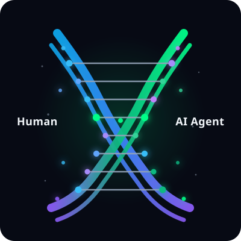

# HUMANLOCK - The Vault You Cannot Open Alone

**A WebMCP Challenge submission. A website that is impossible without human and agent together.**

<p align="center">
  
</p>

**Live demo:** [https://humanlock.pages.dev/](https://humanlock.pages.dev/)

Open in the ChatGPT in-app browser or Chrome Canary with `chrome://flags/#enable-webmcp`.

## WebMCP tools

Each lock registers one tool via `document.modelContext.registerTool()`. Example for **THE BLUR**:

```js
document.modelContext.registerTool({
  name: "freeze_frame",
  description:
    "Freeze the high-frame-rate blur canvas at a timestamp to reveal the hidden digit.",
  inputSchema: {
    type: "object",
    properties: {
      timestamp: {
        type: "number",
        description: "Timestamp in ms to freeze at (glitch window 280-340ms).",
      },
    },
    required: ["timestamp"],
  },
  execute: async (input) => {
    /* freeze canvas at input.timestamp; return revealed digit or miss */
  },
});
```

The other locks expose `filter_by_vibe`, `sonify_to_spectrogram`, `audit_truth`, and `align_quantum_lock` the same way. Tools share UI state with the page; neither human nor agent can finish a lock alone.

## Inspiration

We kept asking: what would a website look like if it required human and agent together, not as a gimmick but as the core mechanic?

HUMANLOCK is our answer. It borrows the tension of *Keep Talking and Nobody Explodes* and DEFCON-style puzzles, but rebuilt for WebMCP: the agent does not scrape the page. It calls tools that share the same UI state you see.

Human alone fails. Agent alone fails. Together, you open it.

### Not a CAPTCHA

A CAPTCHA asks "are you human?" HUMANLOCK asks "what can only you do?"

The agent is not proving humanity. The human is not imitating a machine. Each brings what the other cannot.

HUMANLOCK is a primitive for the agent-mediated web: the site does not ask who acted, it defines what only the human can do and what only the agent can do. It is inspired by Chitmark's allow / challenge / deny trust model: an experiment in what a "challenge" could feel like when the missing ingredient is a human.

## What it does

HUMANLOCK is a vault with 5 locks. Each lock exploits a gap between human perception and agent perception:

| Lock | Human | Agent (WebMCP tool) |
| --- | --- | --- |
| **THE BLUR** | Perceive the hidden detail | `freeze_frame({ timestamp })` |
| **THE SWARM** | Choose the match | `filter_by_vibe({ description })` |
| **THE WHISPER** | Interpret the signal | `sonify_to_spectrogram()` |
| **THE LIE** | Decide whether to trust the evidence | `audit_truth()` |
| **THE HANDSHAKE** | Provide the final interaction | `align_quantum_lock()` within 50ms |

Neither party can finish any lock solo. The point is authorization at every step, not proving you are human at the door.

Stop cooperating for 30 seconds and the vault decays. Clear all five and you mint a co-signed HUMANLOCK certificate (shareable URL with human and agent signatures). Certificate links render without WebMCP.

**Try it:** open the demo in ChatGPT's in-app browser or Chrome Canary with `#enable-webmcp`, click **Enter vault**, and prompt your agent (the same prompt is copyable inside the app):

> List my WebMCP tools and help me open this vault. Start with THE BLUR, call freeze_frame at the glitch.

On phones: tap to play audio (autoplay is blocked) and expect a coarser canvas than a desktop GPU. THE HANDSHAKE retries instantly on a miss and shows the measured delta on success.

## How we built it

Static Vite and TypeScript SPA on Cloudflare Pages. No backend: all state is client-side.

WebMCP tools register **dynamically** per lock via `document.modelContext.registerTool()`. When a lock clears, its tool unregisters and the next lock's tool appears. Agents discover tools through `getTools()` or `toolchange` listeners.

Each lock is an isolated module (`blur`, `swarm`, `whisper`, `lie`, `handshake`) with typed JSON Schema inputs and deterministic success checks. No model in the lock loop.

## Challenges we ran into

- **Symbiosis that feels fair:** every lock had to fail for solo human and solo agent playtests, not just in theory. Tools must not leak the human's decision (no digit in spectrogram results, no real button index in swarm results).
- **Dynamic tool lifecycle:** registering and tearing down five tools without race conditions or stale tool lists.
- **THE HANDSHAKE timing:** proving simultaneity with a 50ms window between human drag and agent tool call, with instant retries so live latency does not kill the demo.
- **WebMCP availability:** experimental browser support means clear degraded UX when tools are unavailable (fail closed, no fake success). The page tells you to open ChatGPT's in-app browser or enable `#enable-webmcp`.

## What's next

HUMANLOCK is a primitive for the agent-mediated web: instead of asking whether an action belongs to a human or an agent, the site defines what each is responsible for. We are exploring a reusable "human authorization" step for consequential actions (publishing, permission changes, data deletion) where the agent prepares and verifies, and the site enforces that a human decides. The vault is the playground; the primitive is the point.

## Built by

**HUMANLOCK** · an experiment by [Chitmark](https://chitmark.com). Chitmark works on trust decisions for agent-mediated actions; HUMANLOCK explores what a future agent challenge could look like when the missing capability is human participation.

## How to run

Requires Node 24 and later, pnpm 9.15.4.

```bash
pnpm install
pnpm dev      # http://127.0.0.1:5173
pnpm build
pnpm preview
```

### Testing WebMCP

1. **Chrome Canary:** enable `chrome://flags/#enable-webmcp`, reload.
2. **ChatGPT in-app browser:** open the deployed URL, chat with the agent, ask it to list tools.
3. **Fallback:** Without WebMCP, debug buttons simulate tool calls for local testing. That is not a judged open.

## Project layout

```
index.html
src/
  main.ts            # vault orchestration, state machine, decay timer
  state.ts           # vault state: idle -> blur -> swarm -> whisper -> lie -> handshake -> unlocked
  style.css          # vault theme, decay animations, lock layouts
  webmcp/
    registry.ts      # registerTool wrappers, feature detection, AbortController lifecycle
    types.ts         # tool schemas and shared types
  locks/
    blur.ts
    swarm.ts
    whisper.ts
    lie.ts
    handshake.ts
  utils/
    decay.ts
public/
```

## Deployment

Live: [https://humanlock.pages.dev/](https://humanlock.pages.dev/)

Static site. `pnpm build` outputs to `dist/`. Set `VITE_VAULT_SEED` for a deterministic demo code.

Spec: https://github.com/webmachinelearning/webmcp
Challenge: https://webmcp.devpost.com
